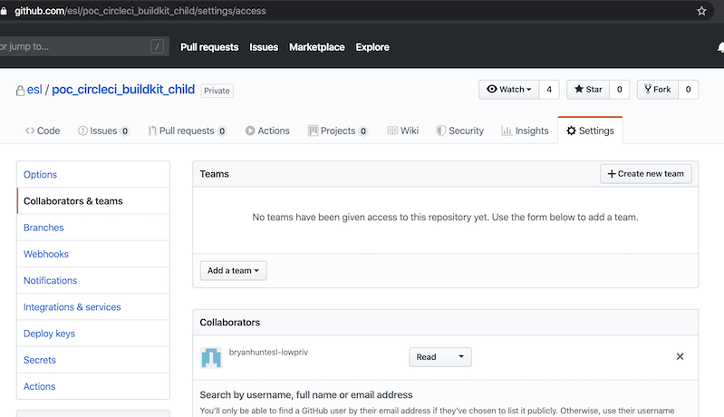
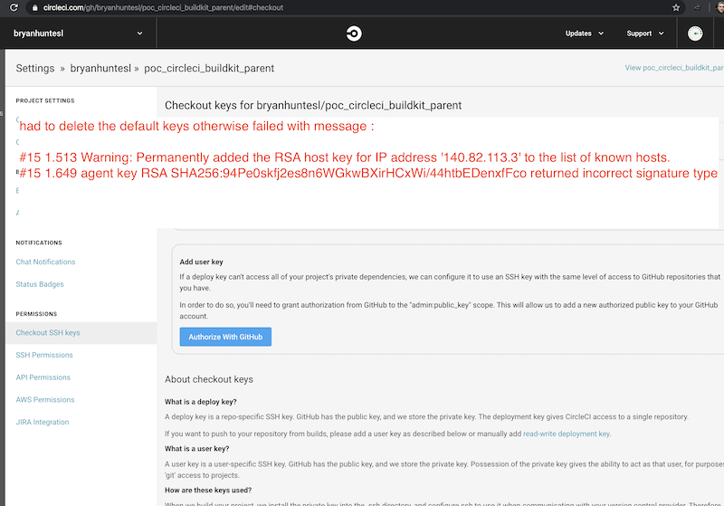

# Proof-of-concept CircleCI with buildkit

The goal is to have a circleci build/docker hub push which :

* retrieves build dependenies from private github repository
* is expressed entirely within standard Dockerfile
* is secure
* Does not copy any SSH keys or passwords into the build container or any other wierd hacks or unsecured HTTP copy
* The build/test/deploy (to local developer machine registry or production GKE registry is identical)
* Developer can debug and verifiy build locally or just send it to CircleCI (YOLO)

## Initial setup

Create parent and child repositories 
* bryanhuntesl/poc_circleci_buildkit_parent
* esl/poc_circleci_buildkit_child (private repository)


### Create low-privelege (read only) user (bryanhuntesl-lowpriv)

Generate a CircleCI compatible openssh keypair and add to bryanhuntesl-lowpriv Github account :

```
    openssl genrsa -out ~/.ssh/circleci 2048
    chmod 600 ~/.ssh/circleci
    ssh-keygen -y -f ~/.ssh/circleci > ~/.ssh/circleci.pub
    chmod 600 ~/.ssh/circleci.pub
```

 

Added bryanhuntesl-lowpriv as a collaborator (with read-only access to the esl/poc_circleci_buildkit_child) repository


 


## Problems

### Default SSH key being in format not understood by ssh-agent 

Lot's during setup - the biggest of which was a strange SSH error from `ssh-agent` :

"#15 1.649 agent key RSA SHA256:94Pe0skfj2es8n6WGkwBXirHCxWi/44htbEDenxfFco returned incorrect signature type"

I couldn't match the message with any of the key signatures displayed in circleci GUI or the key fingerprint I
had specified in the `add_ssh_keys` block:

```
- add_ssh_keys:
          fingerprints:
            - "58:25:b9:3b:e2:7c:46:89:60:26:10:9f:d0:e2:b6:ac"
```

The error manifested as such in the build console : 


I deleted the default CircleCI keys which presume are the keys they inject into your account (does this mean anyone who can push can wreak arbitrary havok ?? (TO be verified))



And the build succeeded - checking out the private git dependency without having to copy SSH keys into the container or any other problematic/insecure stuff.


---

Following lines are just to trigger a build

